# Enhanced Medical Image Segmentation Network

基于对比特征金字塔和错误聚焦不确定性矫正的增强医学图像分割网络。

## 网络架构

该网络包含以下主要组件：

1. **编码器主干** - 四个顺序卷积块，整体步幅为16
2. **对比特征金字塔 (CFPN)** - 多尺度特征融合
3. **多尺度对比特征增强 (MSCFE)** - 空洞卷积增强
4. **多分辨率解码器** - 四个不同尺度的解码器
5. **特征解耦** - 前景、背景和不确定性特征分离
6. **错误聚焦不确定性矫正 (URM)** - 基于熵的不确定性矫正
7. **辅助头** - 多任务学习和原型反馈

## 使用方法

```python
from models.enhanced_medical_seg import EnhancedMedicalSegNet

# 创建模型
model = EnhancedMedicalSegNet(
    in_channels=3,
    num_classes=1,
    base_channels=64,
    prototype_dim=256
)

# 训练
loss = model(images, masks)

# 推理
with torch.no_grad():
    outputs = model(images, training=False)
    predictions = outputs['mask']
```

## 文件结构

```
models/
├── __init__.py
├── enhanced_medical_seg.py    # 主网络模型
├── encoder.py                 # 编码器主干
├── cfpn.py                   # 对比特征金字塔
├── mscfe.py                  # 多尺度对比特征增强
├── decoders.py               # 解码器模块
├── feature_decoupling.py     # 特征解耦
├── urm.py                    # 不确定性矫正模块
└── auxiliary_head.py         # 辅助头
```

## 模型结构图

```mermaid
flowchart LR
    %% ================= 输入 =================
    Input["输入"] --> B1["模块 1"]

    %% =============== 编码器主干 ==============
    subgraph Encoder["编码器主干（整体步幅 16）"]
        direction TB
        B1 --> B2["模块 2"] --> B3["模块 3"] --> B4["模块 4"]
    end

    %% =============== CFPN ==============
    subgraph CFPN["对比特征金字塔 (CFPN)"]
        direction TB
        %% Level 2
        B2 --> B2_low["低分辨率卷积<br/>(步幅 2)"] --> Fuse2["融合<br/>(尺寸对齐↔串接→1×1 卷积)"]
        B2 --> B2_high["高分辨率卷积<br/>(步幅 1)"] --> Fuse2
        Fuse2 --> MSC2

        %% Level 3
        B3 --> B3_low["低分辨率卷积<br/>(步幅 2)"] --> Fuse3["融合<br/>(尺寸对齐↔串接→1×1 卷积)"]
        B3 --> B3_high["高分辨率卷积<br/>(步幅 1)"] --> Fuse3
        Fuse3 --> MSC3

        %% Level 4
        B4 --> B4_low["低分辨率卷积<br/>(步幅 2)"] --> Fuse4["融合<br/>(尺寸对齐↔串接→1×1 卷积)"]
        B4 --> B4_high["高分辨率卷积<br/>(步幅 1)"] --> Fuse4
        Fuse4 --> MSC4
    end

    %% ======= MSCFE =======
    subgraph MSCFE["多尺度对比特征增强 (MSCFE)"]
        direction TB
        B1 --> DC1["空洞卷积 (e₁)"] --> MSC1["MSC1"]
        Fuse2 --> DC2["空洞卷积 (e₂)"] --> MSC2
        Fuse3 --> DC3["空洞卷积 (e₃)"] --> MSC3
        Fuse4 --> DC4["空洞卷积 (e₄)"] --> MSC4
    end

    %% ---------------- 解码器 ----------------
    %% 小型解码器
    subgraph DecSmall["解码器‑S（×2）"]
        direction LR
        DS_U1["上采样 ×2"] --> DS_C1["3×3 卷积"] --> DS_C2["1×1 卷积"] --> DS_Out["DS_Out"]
    end
    MSC1 --> DS_U1

    %% 中型解码器
    subgraph DecMed["解码器‑M（×4）"]
        direction LR
        DM_U1["上采样 ×2"] --> DM_C1["3×3 卷积"]
        DM_C1 --> DM_U2["上采样 ×2"] --> DM_C2["3×3 卷积"]
        DM_C2 --> DM_C3["1×1 卷积"] --> DM_Out["DM_Out"]
    end
    MSC2 --> DM_U1

    %% 大型解码器‑3
    subgraph DecLarge3["解码器‑L3（×8）"]
        direction LR
        DL3_U1["上采样 ×2"] --> DL3_C1["3×3 卷积"]
        DL3_C1 --> DL3_U2["上采样 ×2"] --> DL3_C2["3×3 卷积"]
        DL3_C2 --> DL3_U3["上采样 ×2"] --> DL3_C3["3×3 卷积"]
        DL3_C3 --> DL3_C4["1×1 卷积"] --> DL3_Out["DL3_Out"]
    end
    MSC3 --> DL3_U1

    %% 大型解码器‑4
    subgraph DecLarge4["解码器‑L4（×16）"]
        direction LR
        DL4_U1["上采样 ×2"] --> DL4_C1["3×3 卷积"]
        DL4_C1 --> DL4_U2["上采样 ×2"] --> DL4_C2["3×3 卷积"]
        DL4_C2 --> DL4_U3["上采样 ×2"] --> DL4_C3["3×3 卷积"]
        DL4_C3 --> DL4_U4["上采样 ×2"] --> DL4_C4["1×1 卷积"] --> DL4_Out["DL4_Out"]
    end
    MSC4 --> DL4_U1

    %% ---------- 掩码融合 ----------
    subgraph MaskMerge["掩码融合与预测"]
        direction TB
        DS_Out --> Concat["四路串接 Concat"]
        DM_Out --> Concat
        DL3_Out --> Concat
        DL4_Out --> Concat
        Concat --> Conv1x1["1×1 卷积"] --> Sigmoid["Sigmoid"] --> Mask["Mask P"] --> Lmask["L_mask"]
    end

    %% =========== 特征解耦 ============
    subgraph Decouple["特征解耦"]
        direction LR
        B4 --> CBR1["3×3 卷积<br/>1×1 卷积"] --> ffg["f_fg"]
        B4 --> CBR2["3×3 卷积<br/>1×1 卷积"] --> fbg["f_bg"]
        B4 --> CBR3["3×3 卷积<br/>1×1 卷积"] --> fuc["f_uc"]
    end

    %% =========== URM ===========
    subgraph URM["错误聚焦不确定性矫正 (URM)"]
        direction TB
        Mask --> UR_LOGITS["① 1×1 卷积 → logits"]
        UR_LOGITS --> UR_TSCALE["② 温度缩放 α"]
        UR_TSCALE --> UR_ENT["③ 计算熵"]
        UR_ENT --> UR_ERRMASK["④ 错误掩码"]
        UR_ERRMASK --> UR_ATTEN["⑤ 注意力图"]
        fuc --> UR_UP["上采样 ×16"] --> UR_HADA["⑥ Hadamard 乘积"]
        UR_ATTEN --> UR_HADA
        UR_HADA --> fuc_corrected["f_uc′"]
        GT(["真值 GT"]) --> UR_ERRMASK
    end

    %% ========= 辅助头 ==========
    subgraph AuxHead["辅助头 + 不确定性"]
        direction TB
        ffg --> AlignFG["1×1 卷积"] --> Aux
        fbg --> AlignBG["1×1 卷积"] --> Aux
        fuc_corrected --> AlignUC["1×1 卷积"] --> Aux
        Aux["Softmax → {U_fg, U_bg, U_compl}"] --> Fore["前景"] --> Lfg["L_fg"]
        Aux --> Back["背景"] --> Lbg["L_bg"]
        Aux --> Unc["不确定性"] --> Lcompl["L_compl"]
    end

    %% ========= 原型反馈 =========
    ffg -.-> MSC1
    ffg -.-> MSC2
    ffg -.-> MSC3
    ffg -.-> MSC4

    fbg -.-> MSC1
    fbg -.-> MSC2
    fbg -.-> MSC3
    fbg -.-> MSC4

    fuc_corrected -.-> MSC1
    fuc_corrected -.-> MSC2
    fuc_corrected -.-> MSC3
    fuc_corrected -.-> MSC4

    %% ========= 损失反馈 =========
    Lfg -.-> MSC1
    Lfg -.-> MSC2
    Lfg -.-> MSC3
    Lfg -.-> MSC4

    Lbg -.-> MSC1
    Lbg -.-> MSC2
    Lbg -.-> MSC3
    Lbg -.-> MSC4

    Lcompl -.-> MSC1
    Lcompl -.-> MSC2
    Lcompl -.-> MSC3
    Lcompl -.-> MSC4

    Lmask -.-> MSC1
    Lmask -.-> MSC2
    Lmask -.-> MSC3
    Lmask -.-> MSC4
```



====================================================================
Enhanced Medical‑Image Segmentation Network · 2025‑07‑19
====================================================================

This comment block is a concise, publication‑ready English description
that mirrors the *latest* Mermaid diagram.  Paste it, as–is, above or
below the diagram code so reviewers can read a self‑contained overview.

--------------------------------------------------------------------
1. Input
--------------------------------------------------------------------
• Accepts a pre‑processed medical image (e.g., 512 × 512 × 3).

--------------------------------------------------------------------
2. Encoder Backbone (overall stride 16)
--------------------------------------------------------------------
Four sequential convolutional blocks (Module 1 → 4) extract low‑,
mid‑ and high‑level features B1‑B4.  Outputs are consumed by CFPN,
MSCFE and the decoupling branch.

--------------------------------------------------------------------
3. Contrastive Feature Pyramid (CFPN)
--------------------------------------------------------------------
For B2‑B4, each level has a **high‑res path** (stride 1) and
**low‑res path** (stride 2).  Spatial sizes are *first aligned*
(Resize) before **Concat → 1 × 1 Conv** fusion.  The fused tensors
Fuse2‑4 feed MSCFE.

--------------------------------------------------------------------
4. Multi‑Scale Contrastive Feature Enhancement (MSCFE)
--------------------------------------------------------------------
Applies dilated convolutions (e₁‑e₄) to B1 and Fuse2‑4, yielding
MSC1‑MSC4.  These serve as sources for four resolution‑specific
decoders and receive prototype feedback.

--------------------------------------------------------------------
5. Decoders & Mask Prediction
--------------------------------------------------------------------
| Decoder | Source  | Upsampling Chain                 | Output scale |
|---------|---------|----------------------------------|--------------|
| S (×2)  | MSC1    | ↑2 → Conv3×3 → Conv1×1           | 1×           |
| M (×4)  | MSC2    | ↑2 → Conv → ↑2 → Conv → Conv1×1  | 1×           |
| L3 (×8) | MSC3    | ↑2 → Conv ×3 → Conv1×1           | 1×           |
| L4 (×16)| MSC4    | ↑2 ×4 → Conv ×4 → Conv1×1        | 1×           |

All four 1× outputs are concatenated, then a 1 × 1 Conv + Sigmoid
produces the final probability map (loss **L_mask**).

--------------------------------------------------------------------
6. Feature Decoupling & Prototypes
--------------------------------------------------------------------
From B4, three branches generate **f_fg**, **f_bg**, **f_uc** via
3×3 Conv → 1×1 Conv (channel = K).  f_uc is refined by URM.

--------------------------------------------------------------------
7. Error‑Focused Uncertainty Rectifier (URM)
--------------------------------------------------------------------
1. 1×1 Conv on predicted mask → logits  
2. Temperature scaling α  
3. Pixel‑wise entropy  
4. Error mask via GT comparison  
5. Attention on erroneous / uncertain pixels  
6. f_uc (stride 16) **Upsample ×16** → Hadamard with attention  
7. Output f_uc′ (corrected uncertainty prototype)

--------------------------------------------------------------------
8. Auxiliary Head
--------------------------------------------------------------------
Aligned prototypes {f_fg, f_bg, f_uc′} → 1×1 Conv → Softmax →
{U_fg, U_bg, U_compl}.  Losses **L_fg, L_bg, L_compl** guide the
decoupling branch and indirectly enhance MSCFE.

--------------------------------------------------------------------
9. Prototype & Loss Feedback
--------------------------------------------------------------------
Prototypes and losses are broadcast back to MSC1‑MSC4 at every
iteration, closing the contrastive loop.

--------------------------------------------------------------------
Key Revisions vs. earlier draft
--------------------------------------------------------------------
• **CFPN** now explicitly resizes before Concat to avoid mismatch.  
• All decoder outputs are up‑sampled to *exact* 1× scale before fusion.  
• URM up‑sampling clarified: stride 16 → 1 via ×16.  
• Tables & names aligned with diagram IDs for reproducibility.
--------------------------------------------------------------------

